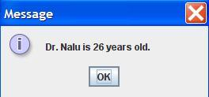

## Instructions 

Write a Java application that does the following.

1. For this program, add on to the code for Assignment #8.
1. Add a (non-static) method to the Person class that adds the String "Dr." to the beginning of the name of a Person object. The name of this method should be phd(). The return type is void. The method has no parameters. In other words, this method changes the value of the data field for the name.
1. Add a (non-static) method to the Person class that adds 1 (one) to the age of a Person object. The name of this method should be birthday(). The return type is void. The method has no parameters. In other words, this method changes the value of the data field for the age.
1. In the main method, print out the Person object (person variable), using the toString() method. Do NOT use the System.out.println() method, instead use the JOptionPane.showMessageDialog() method.
1. Then call both the phd() method and birthday() methods. Again, output the object using the toString() method, and the JOptionPane.showMessageDialog() method.
1. Use the second name and age to instantiate another Person object. Use the toString() method, and the JOptionPane.showMessageDialog() method to output the information.
1. Then call both the phd() method and birthday() methods for the second Person object. Again, output the object using the toString() method, and the JOptionPane.showMessageDialog() method.
1. Below your LastnameFirstname9 class, create a second class in your LastnameFirstname9.java file.
1. Unlike your LastnameFirstname9 class, do NOT include the public modifier. In other words, the code for your Person class should look like this:


	class Person{
		//data fields for name and age
		//constructor
		//toString() method
		//phd() method
		//birthday() method
	}
  	
  
1. See FractionCalculatorInOneFile.java for an example of several classes in one Java file.
1. Create two data fields. One data field for name and a second data field for age in your Person class.
1. Write the constructor for your Person class. You should have a String and Integer (or int) parameters, which initialize your two data fields.
1. Write the toString() method for your Person class. The return value should have the format: "X is Y years old."
1. Write the phd() method for your Person class. The return type is void. The method has no parameters.
1. Write the birthday() method for your Person class. The return type is void. The method has no parameters.
1. Make sure your code follows the ICS 211 Java Coding Standard, in particular the Java documentation (Javadoc) comments that go above each method.
1. Write your original comments every 3-5 lines of code.
1. WARNING: In the edit method, do NOT copy my code or my comments. Use my code as a guide to write your own code.
1. Make sure your code follows the ICS 211 Java Coding Standard, in particular the Java documentation (Javadoc) comments that go above each method.

## Example output

Here is example output for commandline arguments: <b>Nami 20 Nalu 25</b>

	 
	
	 
  	 	
	
	 
  	 		
	
	 	
  	 	
	

