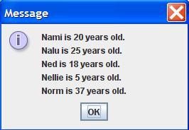

## Instructions

Write a Java application that does the following.

1. In the main() method, take 5 String/Integer pairs as commandline input.
1. These 10 variables represent a name, an age (in years), a second name, a second age (in years), etc.
1. In the main() method, instantiate 5 PersonNode objects. The 1st PersonNode object is initialized to the 1st name and age pair in the commandline input. The 2nd PersonNode object is initialized to the 2nd name and age pair in the commandline input. Etc.
1. In the main() method, link the 5 nodes together using the setNext() method. Use the same order as the commandline input. The last PersonNode should have the next data field set to null.
1. From the 1st PersonNode object, loop through the other 4 PersonNode objects. Use the loop to create a String for output.
1. In the main method, print out all the PersonNode objects. Do NOT use the System.out.println() method, instead use the JOptionPane.showMessageDialog() method.
1. Below your LastnameFirstname15 class, create a second class in your LastnameFirstname15.java file, which is the class PersonNode.
1. Unlike your LastnameFirstname15 class, do NOT include the public modifier. The code for your PersonNode class should look like this:


	class PersonNode{
		//data fields are name, age, and next
		//constructor to initialize all 3 data fields
		//toString() method returns "X is Y years old"
		//getNext() method returns next
		//setNext() method sets next to the parameter's value
	}
    
	
1. See FractionCalculatorInOneFile.java for an example of several classes in one Java file.
1. The PersonNode class is similar to the Node.java class, but it is NOT generic. Do NOT use <T>.
1. In the PersonNode class, use a data field for the name of the person, a data field for the age of the person, and a data field that points (contains the address of) the next PersonNode object.
1. The PersonNode constructor should initialize the data fields for name and age.
1. The PersonNode method toString() should output: 
1. "X is Y years old."
1. The PersonNode method getNext() should return a pointer (address) to the next PersonNode object.
1. The PersonNode method setNext() should set the next data field to point to (contain the address of) the next PersonNode object.
1. Write your original comments every 3-5 lines of code.
1. WARNING: In the edit method, do NOT copy my code or my comments. Use my code as a guide to write your own code.
1. Don't forget to add "JavaDoc" style comments above each method. See ICS 211 Java Coding Standard (Comments: Methods) for details.

## Example output

Here is example output for commandline arguments: <b>Nami 20 Nalu 25 Ned 18 Nellie 5 Norm 37</b> 

	 
	
	 

