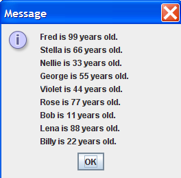

## Instructions 

Write a Java application that does the following.

1. In the main() method, take 1 file name as the commandline input.
1. The file is a CSV (comma separated values) file with a top row of headings, a first row of names, and a second row of ages. For example, see input16.csv
1. Using the String args[0], create a file object.
1. Using the file object, create a Scanner object to connect to the file.
1. When you read the file, skip over the first line in the file. For example: 
1. String firstLineInFile = scanner.nextLine();
1. Does your program work so far? Compile and run your program. Use either the jGRASP debugger (see lesson #3 slides and podcast for instructions) or System.out.println() statements to check your code. And continue to take small steps (compile, run, and check values of variables) whenever you write a program. When you no longer need your output statements, comment them out. For example: 
1. System.out.println("firstLineInFile = " + firstLineInFile);
1. You might need to use the useDelimiter() method to separate the name from the age. Breaks the line into tokens (words, numbers, etc.). Each token separated by comma (","). Then use method next() to get name and use next() again to get the age. For example: 
1. String line = scanner.nextLine(); Scanner tokenInput = new Scanner(line).useDelimiter(",");
1. name = tokenInput.next();
1. age = tokenInput.next();
1. In the main() method, read the data in the file, and store each row of names and ages as a PersonNode in a LinkedList. Your LinkedList is similar to my LinkedList, but your LinkedList is NOT generic type, so don't use <T>. Instead of Node, use PersonNode to store the data of each person.
1. For the add() method of the LinkedList class, the parameters should be the name and age. The add() method should add each node to the end of the list. For example: 
1. LinkedList list = new LinkedList;
1. list.add(name, age);
1. In the main() method, use the toString() method of the LinkedList object to display all the PersonNode objects in the LinkedList object.
1. Use the JOptionPane.showMessageDialog() method for your output.
1. Below your LastnameFirstname16 class, create a second class in your LastnameFirstname16.java file, which is the class LinkedList.
1. Unlike your LastnameFirstname16 class, do NOT include the public modifier. The code for your LinkedList class should look like this:


	class LinkedList{
		//data field (private PersonNode head)
		//add() method with two parameters (name and age)
		//toString() method
	}
 
	
1. See FractionCalculatorInOneFile.java for an example of several classes in one Java file.
1. The linked list in your assignment is NOT a generic linked list that is provided as example code. You can use the example generic linked list as a guide on how to design a linked list; however, the methods for your linked list, and the nodes used in your linked list are PersonNode, so somewhat different than the generic linked list and generic node class in the example code.
1. The add() method should have parameters for the name and age. In the method definition, the add() method should create a new PersonNode object. In the method definition, loop to the end of the linked list, and add the new PersonNode object to the end of the linked list.
1. The toString() method should return a String that displays the toString() output for each PersonNode object on a separate line. See the example output below.
1. Below your LastnameFirstname16 class, create a third class in your LastnameFirstname16.java file, which is the class PersonNode.
1. Unlike your LastnameFirstname16 class, do NOT include the public modifier. The code for your PersonNode class should look like this:


    class PersonNode{
		//data fields are name, age, and next
		//constructor to initialize all 3 data fields
		//toString() method returns "X is Y years old"
		//getNext() method returns next
		//setNext() method sets next to the parameter's value
	}
   
	
1. See FractionCalculatorInOneFile.java for an example of several classes in one Java file.
1. In the PersonNode class, use a data field for the name of the person, a data field for the age of the person, and a data field that points (contains the address of) the next PersonNode object.
1. The PersonNode constructor should initialize the data fields for name and age.
1. The PersonNode method toString() should output: 
1. "X is Y years old."
1. The PersonNode method getNext() should return a pointer (address) to the next PersonNode object.
1. The PersonNode method setNext() should set the next data field to point to (contain the address of) the next PersonNode object.
1. Write your original comments every 3-5 lines of code.
1. WARNING: In the edit method, do NOT copy my code or my comments. Use my code as a guide to write your own code.
1. Don't forget to add "JavaDoc" style comments above each method. See ICS 211 Java Coding Standard (Comments: Methods) for details.

## Example output

Here is example output for commandline arguments: <b><a href="input16.csv">input16.csv</a></b>

	 
	
	 

