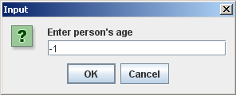

## Instructions1. Write a Java application that does the following.

1. In the main() method, take 1 file name as the commandline input.
1. The file is a CSV (comma separated values) file with a top row of headings, a first row of names, and a second row of ages. For example, see input17.csv
1. In the main() method, read the data in the file, and store each row of names and ages as a PersonNode in a LinkedList.
1. For the add() method of the LinkedList class, the parameters should be the name and age. The add() method should add each node to the end of the list.
1. In the main() method, use the toString() method of the LinkedList object to display all the PersonNode objects in the LinkedList object.
1. In the main() method, repeatedly ask the user to enter the age. Use a while loop and JOptionPane.showInputDialog() to do this.
1. List all the PersonNodes that have the same age as the user entered. To do this, in the same while loop, call the displayPeopleWithSameAge() method and the JOptionPane.showMessageDialog() method.
1. If there are no matching ages, you need to display "There are no matching ages for age X", where "X" is the age that the user entered.
1. Quit the program, when the user enters -1 (negative one) for the age.
1. Use the JOptionPane.showMessageDialog() method for your input and output.
1. Below your LastnameFirstname17 class, create a second class in your LastnameFirstname17.java file, which is the class LinkedList.
1. Unlike your LastnameFirstname17 class, do NOT include the public modifier. The code for your LinkedList class should look like this:


class LinkedList{
  //data field(s)
  //void add(String, Integer) method
  //String toString() method
  //String displayPeopleWithSameAge(Integer) method
}
 
	
See FractionCalculatorInOneFile.java for an example of several classes in one Java file.
The linked list in your assignment is NOT a generic linked list that is provided as example code. You can use the example generic linked list as a guide on how to design a linked list; however, the methods for your linked list, and the nodes used in your linked list are somewhat different than the generic linked list and generic node class in the example code.
The add() method should have parameters for the name and age. In the method definition, the add() method should create a new PersonNode object. In the method definition, loop to the end of the linked list, and add the new PersonNode object to the end of the linked list.
The toString() method should return a String that displays the toString() output for each PersonNode object on a separate line. See the example output below.
The displayPeopleWithSameAge() method should return a String that displays the all the PersonNode objects that have the same age on a separate line. The only parameter to the method should be an Integer that represents the age of a person. See the example output below.
Note that the point of this assignment is to learn how to loop through a linked list. Therefore, your displayPeopleWithSameAge() method should loop through the linked PersonNodes and then use an if-statement to find the PersonNodes which have the same age as the user's input. You need to add a getAge() method to your PersonNode class.
Below your LastnameFirstname17 class, create a third class in your LastnameFirstname17.java file, which is the class PersonNode.
Unlike your LastnameFirstname17 class, do NOT include the public modifier. The code for your PersonNode class should look like this:


	class PersonNode{
		//data fields
		//constructor
		//toString() method
		//getNext() method
		//setNext() method
		//getAge() method
	}
 
	
1. See FractionCalculatorInOneFile.java for an example of several classes in one Java file.
1. In the PersonNode class, use a data field for the name of the person, a data field for the age of the person, and a data field that points (contains the address of) the next PersonNode object.
1. The PersonNode constructor should initialize the data fields for name and age.
1. The PersonNode method toString() should output: "X is Y years old."
1. The PersonNode method getNext() should return a pointer (address) to the next PersonNode object.
1. The PersonNode method setNext() should set the next data field to point to (contain the address of) the next PersonNode object.
1. Write your original comments every 3-5 lines of code.
1. WARNING: In the edit method, do NOT copy my code or my comments. Use my code as a guide to write your own code.
1. Don't forget to add "JavaDoc" style comments above each method. See ICS 211 Java Coding Standard (Comments: Methods) for details.

## Example output

Here is example output for commandline arguments: <b><a href="input17.csv">input17.csv</a></b>

 
   
	
 
   	
	
 
  	
		
 
 
	
 
 	
	
 
 
	
 
 
	
 
 
	
 
   

  
  	