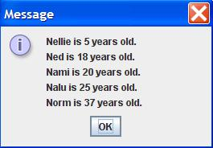

## Instructions

Write a Java application that does the following.

1. Takes 5 String/Integer pairs as commandline input.
1. These 10 variables represent a name, an age (in years), a second name, a second age (in years), etc.
1. In the main method, instantiate an array of 5 Person objects The 1st element in the array is the Person object with the 1st name and age pair in the commandline input. The 2nd element in the array is the Person object with the 2nd name and age pair in the commandline input. Etc.
1. In the main method, print out all the Person objects (person variables), in the array of 5 Persons. Do NOT use the System.out.println() method, instead use the JOptionPane.showMessageDialog() method.
1. <b>Choose the appropriate sorting method</b> in the Sorting.java program to sort the array of 5 Persons IN ORDER by increasing AGE.
1. To do this, you need to save the Sorting.java program in the same folder as your LastnameFirstname11.java program.
1. You DO NOT need to change any code in the Sorting.java program.
1. To prevent the automatic output of the Sorting.java program, use this code before you sort: Sorting.display = false;
1. <b>Justify your choice of sorting method in the comments at the top of your program</b>
1. In the main method, print out all the Person objects (person variables), in the array of 5 Persons. Do NOT use the System.out.println() method, instead use the JOptionPane.showMessageDialog() method.
1. Below your LastnameFirstname11 class, create a second class in your LastnameFirstname11.java file.
1. Unlike your LastnameFirstname11 class, do NOT include the public modifier. You also need to implement the Comparable interface and include a getAge() method. In other words, the code for your Person class should look like this:


	class Person implements Comparable{
		//data fields
		//constructor
		//toString() method
		//getAge() method
		//compareTo() method
	}

	
2. See FractionCalculatorInOneFile.java for an example of several classes in one Java file.
2. Create two data fields. One data field for name and a second data field for age in your Person class.
2. Write the constructor for your Person class. You should have a String and Integer (or int) parameters, which initialize your two data fields.
2. Write the toString() method for your Person class. The return value should have the format: "X is Y years old."
2. Write the getAge() method for your Person class. This method returns the age of the Person.
2. Write the compareTo() method for your Person class. The parameter of the compareTo() method is of class Object. You need to cast the class Object parameter to a class Person variable. See the Fraction class for an example of casting in the compareTo() method. Next, you need to subtract the age of the first person object from the second person object. For example: int result = this.getAge() - person2.getAge(); Finally, you return the result.
2. Write your original comments every 3-5 lines of code.
2. WARNING: Do NOT copy my code or my comments. Use my code as a guide to write your own code.
2. Don't forget to add "JavaDoc" style comments above each method. See ICS 211 Java Coding Standard (Comments: Methods) for details.

## Output

	Here is example output for commandline arguments: <b>Nami 20 Nalu 25 Ned 18 Nellie 5 Norm 37</b>
 
	 
	
	 
  	 
	
 

    